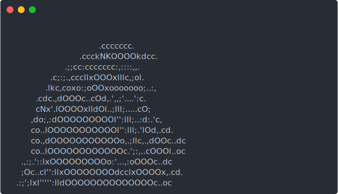

# Checking how to render svg animations in github

# Mine animation relative file path

# Mine animation gdrive

# term2svg animation relative file path

# Other, parrot, relative path

# Image tag, relative fle path to mine

    

# Image tag, relative fle path to term2svg

    

# Image tag, relative fle path to js

    

# Image tag, mine, link to animation

    

# Image tag, link to term2svg animation

    

# Image tag, link to parrot js animation file
they use raw git which will be taken down. so can't use it any more.
# Image tag, link to parrot animation

    

# Image tag to mine raw animation link 

# Attempts with RAW

    

    

    

    

    

    

    

